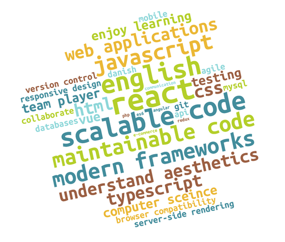

# Individual job analysis

See [/jobs/](./jobs) for the relevant job posting

# Shape (recruitment by Academic Work)

**Position**\
Front-end Developer\
Entry level

**Listed Qualifications**\
React (or other front-end framework), web applications, JavaScript and ES6, server-side technologies, server-side rendering, API design, understand cross-browser compatibility, work with tight deadlines, excellent English skills

*Bonus Qualifications*\
Typescript

**Relevance**\
I believe this job is relevant to me and would maybe apply for it.

The recruitment process isn't done by Shape but instead through a company called Academic Work, which feels a bit impersonal, especially given that they have other positions which they handle directly themselves (see <https://www.shape.dk/careers>). There's a lot about what they expect from the employee but little about Shape itself in the job posting.

Academic Work is a recruiting company specifically designed focused on bringing young professionals together with businesses.

**Work Environment**\
Shape is a private company with 100+ employees. They operate out of Denmark and Switzerland. The Danish office is in Islands Brygge.

They design mobile digital solutions (apps) for clients such as IKEA, Nordisk Film, Fitness World, among others. They also invest in app ideas such as GoLittle (an app for finding places to go with small children) and FarmBackup (an app for renting farm equipment).

They have videos of their office on LinkedIn. The office is a very open space with multiple floors. The main floor is for the computer/desk work, while the upper floor have meeting rooms with large glass doors. The work space embodies transparency/openness.

The job posting itself does not mention much about Shape, but looking at Shape's own job postings, they seem to enjoy socializing together even on weekends. Of the 100+ employees they have listed (see <https://www.shape.dk/about>) many of them are international and/or women. They seem to lean primarily towards younger employees.

They are hardworking, having released over 200 products since being founded in 2010, which explains their 'meet tight deadlines' requirement.

# Accenture

**Position**\
Interactive Frontend Developer\
Mid-Senior Level

**Listed Qualifications**\
JavaScript, 3+ years dev experience, advanced JS frameworks (e.g. React, Angular, or Vue), experienced with Agile practices, structured/tested code, basic Danish skills, enjoy sharing experience.

*Bonus Qualifications*\
E-commerce, digital platforms (e.g. Adobe CQ/AEM, Hybris, Intershop, Episerver, or Sitecore), Progressive Web Apps, Database (SQL, MongoDB, etc), Fluent English, fluent in European languages on business level.

**Relevance**\
I believe this job is relevant to me and would apply for it.

While I've not had professional experience as a developer, I have had ~2 years in this school and several years of my own freetime learning. I otherwise meet the listed qualifications and believe that, though I'm not an *expert* in the things listed, I would quickly learn it. The office location is close to home and they even give the ability to address disabilities right out of the gate if needed.

It would be a difficult first job as they're looking for a senior level developer, but after looking at this, I'd be encouraged to send an unsolicited application for a non-senior dev position.

**Work Environment**\
Accenture is a global company originally from Ireland with *several* branches such as Strategy, Digital, Technology, etc. They are a large public consultancy (of over 480,000 employees globally) that offers interactive and digital products for many clients.

Accenture is a large private company. They don't have a Danish branch but a Scandinavian branch, which speaks a lot for the scale of the company as a whole. This job will be under the Scandinavian Accenture Interactive.

Accenture lists many benefits outside of work, being very explicit about their focus on work/life balance. They also seem very friendly, inviting people to come visit them in their office to get a feel for the place.

<https://www.accenture.com/dk-en/careers/life-at-accenture/work-environment> Shows some peeks at their work place. There are pops of color through out in the actual office. On top of that, they mention various ways to be able to work: such as job-sharing, part-time/flex-time schedules, and telecommuting.

Overall the company seems very flexible to work with and like a great place to have a long term career.

# JYSK

**Position**\
Frontend Developer\
Associate

**Listed Qualifications**\
2+ years dev experience, JavaScript, ReactJS, Redux, Webpack, PHP7, Responsive Design, LAMP-stack (Linux, Apache, MySQL, PHP), English (professional), Danish (conversational).

**Relevance**\
I believe this job is relevant to me but would not want to apply for it.

The location is far from where I live and I'm currently not looking to relocate. However, if location weren't an issue, I believe that, while I have not worked with Redux before nor had professional experience of at least 2-3 years, I am able to do most of the things they ask for and can easily learn to do the other things given some time.

I believe it would be a stressful first job in the branch where I wouldn't be taught or have time to learn many of the small things that *come* with working professionally. I do not think I'm ready for that as of right now.

**Work Environment**\
Located in Brabrand, Middle Jutland, Denmark. That's their Head Office.

SCRUM team and sparring (agile), quick process, opportunity to develop, international company, salary matching qualifications/experience, ambitious and heavily focused on using IT Development.

JYSK is a Danish brand that now has 2900 physical stores in 51 countries. Management and culture of JYSK is Scandinavian in nature.

https://www.jysk.com/organisation Of the 28 listed, only 2 are women. There's a Vice President of Finance and IT (Henrik Naundrup) and Vice President of Customer Experience and Digital (Niels Veien).

Web Development leader is Liliana Hajek (not listed under organization).

Their Danish career site (job.jysk.dk) looks awful. No CSS or JS is actually being applied due to Mime-type errors, which is very unappealing as an interested developer. This implies to me that, even though they have a dev lead and promise a team of developers, nobody has cared to ensure proper MIME-types on their files. It's only their career site, but it's their first impression on any interested developers looking for a job with them.

Their existing webstore (jysk.dk) looks to use recent technologies, such as the loading attribute on images which was only supported in Chrome as recently as of 2019, and in some other browsers as of 2020. Images are properly optimized. This goes to show that there are other people in their team that stay up to date with latest developments in the web branch and are willing to implement these things.

# Planday

**Position**\
Frontend Developer\
Entry level

**Listed Qualifications**\
HTML, CSS, JavaScript, Structured code, Testable code, Scalable code, Modern frameworks (React and friends), Testing web apps, Behaviour driven development, Version control (Git/Subversion), Excellent English

*Bonus Qualifications*\
Type checkers (Typescript/Flowtype), Develop back-end API in typed language (i.e. C#, Java, etc), React Redux

**Relevance**\
I believe this job is relevant and would apply for it.

I don't have a lot of experience with testing web apps as I haven't used Jest much nor have I tried Behaviour Driven Development, but I believe that I can learn it within a reasonable amount of time. Otherwise, I am able to meet their current expectations.

They emphasize being a very international community and have great location that I can easily travel to and from.

**Work Environment**\
Planday is a Danish private company founded in 2004 with 180 employees and 6 offices around the world. They sell Software as a Service (SaaS) and that is primarily what all developers focus on maintaining.

On LinkedIn they have a video that also shows parts of their office. It seems to be a very open space with lots of windows and light. They also have some Instagram photos (see <https://www.instagram.com/p/CBLHWO1h4Pv/>) showing the office off.

Planday has a lot of diversity in its staff, of different genders, ages, nationalities, and also focus.

Working for them would mean working for a single 'brand' of projects. Because of the open space design of the office, it's easy to go and find someone from marketing or another division if you need to talk to them about something relevant to them. Almost every part in the process of maintaining the software has an inhouse representative.

Their website is beautiful and bright, with lots of pops of colors. Those pops of colors are also seen through out the office in the videos and photos I'm able to see, as part of Planday branding.

Planday seems like it would be a very fun company to work for where you can get all sorts of perspectives on a single project beyond just the tech parts.

Storytel
========

**Position**\
Frontend Developer\
Entry level

**Listed Qualifications**\
2+ years building web applications, HTML, CSS, JavaScript, TypeScript, Modern frameworks (React, Vue, Angular, etc.), fluent English, team player.

*Bonus Qualifications*\
Understand back end of web apps, involved in Open-source, Uni degree in computer science.

**Relevance**\
I believe this job is relevant and would maybe apply for it.

I don't have 2 years of *professional* experience but otherwise meet all their listed qualifications. I also have some understanding of back end from my personal studies.

I'd apply for the Copenhagen office which is in reasonable travel distance from my home.

**Work Environment**\
Storytel is a large private company that originated in Sweden. It is now global with offices all over the world and 500+ employees. The Danish branch of Storytel has merged with Mofibo and goes by that name in Denmark, but the ad was put out under Storytel's name.

Work would be focused on developing Storytel's main product: their ebook software.

It is hard to find details about the Copenhagen office. There are 17 coworkers in that branch (see <https://jobs.storytel.com/locations/copenhagen>), with at least 2 of them being developers. The ad mentions a welcome culture but doesn't offer any concrete benefits aside from community and the ability to grow.

It might be hard to work with others. Even for just the tech department, they are spread out across 5 offices in Sweden and Denmark. A lot of communication will have to be done through online meetings, emails, or lots of travel.

Summary analysis based on five postings (EXTRA)
=========================================================================================================================

\

The wordcloud above represents all the listed required/bonus skills mentioned in the postings, with required skills given a weight of 2 and bonus skills of 1. Each time the skill was mentioned in an posting, the weight was increased by the respective amount, depending on if it was required or just a bonus to them. Some words may not have made it if their weight was too low due to size constraints.

Although we're educated as web developers, our role is more commonly called frontend development.

There are primarily two kinds of companies looking for developers. Agencies that develop products for clients OR a company looking to develop products for their own brand.

All the ads I looked at are private companies on the larger side. Three were listed as 'starter'/'entry' positions, while the other two seek more advanced employees. However, all five had very similar expectations from applicants despite the difference in expected seniority levels.

I also specifically looked for ads that were in English, as I thrive best in an English-speaking environment. From what I could find, English ads in Denmark usually come from larger, global companies. Ads written in Danish were more likely to come from Public or Smaller Private companies. I found that it was more common to find English ads on LinkedIn than on any other platform that I looked through.

Most companies are looking for an ability to use JavaScript Frameworks -- ReactJS being the most common explicitly named framework. Even if they specify one framework, it's generally understood in most job postings that if you know any of the frameworks, including Vue, you can learn the other.

Very few job postings explicitly mentioned needing to know HTML and CSS. This might be because they have other people handle those parts. What's most likely, however, is that HTML/CSS knowledge is implicit in being able to use a framework. That's because most frameworks *combine* HTML and CSS with the JavaScript.

Another common requirement that the ads had was well-tested/clean code. Given that these ads are for developers that will work in a team, it makes sense that the developer would have to write code matching a team standard which can easily be mixed with others code. Typescript, while not a method of testing, is often used to help create cleaner, maintainable code, and is mentioned just as frequently.

On top of that, almost every ad *does* mention having an eye for aesthetics, which would mean you'd need to understand how to create a product that's aesthetically pleasing -- which means needing to use CSS. Some mention that the applicant will be working with designers or their existing UI/UX team, but it is uncertain if those peers would handle the HTML/CSS.

While none of the ads *require* backend knowledge, all of them mentioned some appreciation for it. Similar to understanding aesthetics to better work with designers, being able to understand backend would allow the developer to work better with the backend developers and even help out should it be needed. Even if I don't plan on become a full-stack/backend developer, it goes to show that it is valuable to have at least some backend knowledge.

With all five ads coming from larger private businesses it is not surprising that they all mention the applicant will be working in a team and thus expected to be a team player and eager to share knowledge. Some postings mention Agile outright or some agile practices, like scrums or code reviews.